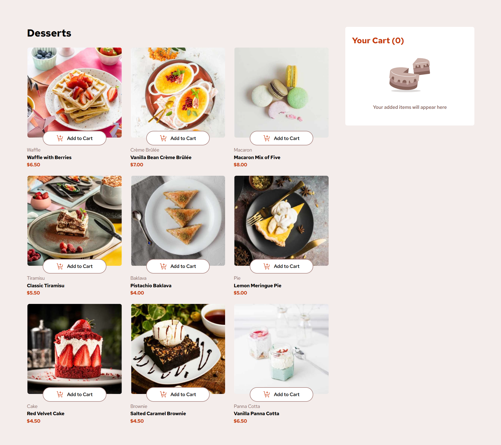

# Frontend Mentor - Product list with cart solution

This is a solution to the [Product list with cart challenge on Frontend Mentor](https://www.frontendmentor.io/challenges/product-list-with-cart-5MmqLVAp_d). Frontend Mentor challenges help you improve your coding skills by building realistic projects. 

## Table of contents

- [Overview](#overview)
	- [The challenge](#the-challenge)
	- [Screenshot](#screenshot)
	- [Links](#links)
- [My process](#my-process)
	- [Built with](#built-with)
	- [What I learned](#what-i-learned)
	- [Continued development](#continued-development)
	- [Useful resources](#useful-resources)
- [Author](#author)
- [Acknowledgments](#acknowledgments)

## Overview

### The challenge

Users should be able to:

- Add items to the cart and remove them
- Increase/decrease the number of items in the cart
- See an order confirmation modal when they click "Confirm Order"
- Reset their selections when they click "Start New Order"
- View the optimal layout for the interface depending on their device's screen size
- See hover and focus states for all interactive elements on the page

### Screenshot



### Links

- Solution URL: https://github.com/DanKRT-Star/product-list-with-cart-main
- Live Site URL: [Product list with cart main](https://product-list-with-cart-main-flame-psi.vercel.app/)

## My process

### Built with

- Semantic HTML5 markup
- CSS custom properties
- Flexbox
- CSS Grid
- Mobile-first workflow
- [React](https://reactjs.org/) - JS library
- [Vite](https://vitejs.dev/) - Build tool
- [Tailwind CSS](https://tailwindcss.com/) - Utility-first CSS framework

### What I learned

While working on this project, I practiced:

- Managing cart state with React (`useState`), passing props between components.
- Handling increase/decrease/remove product quantity in the cart.
- Displaying order confirmation modal and resetting the cart.
- Responsive UI with Tailwind CSS, using flex/grid for layout.
- Using images, fonts, and colors according to the design.

Example cart management code:
```js
const addToCart = (product) => {
	setCart(prevCart => {
		const found = prevCart.find(item => item.name === product.name);
		if (found) {
			return prevCart.map(item =>
				item.name === product.name
					? { ...item, quantity: item.quantity + 1 }
					: item
			);
		} else {
			return [...prevCart, { ...product, quantity: 1 }];
		}
	});
};
```

### Continued development

I want to continue improving:

- Performance optimization for large carts.
- Add animations for confirmation modal and interactive buttons.
- Write tests for main features.
- Refactor components and use Context API for global state management.

### Useful resources

- [React Docs](https://react.dev/learn) - Official React documentation.
- [Tailwind CSS Docs](https://tailwindcss.com/docs) - Official Tailwind documentation.
- [Frontend Mentor Community](https://www.frontendmentor.io/community) - Q&A and experience sharing.

## Author

- Frontend Mentor - [@DanKRT-Star](https://www.frontendmentor.io/profile/DanKRT-Star)
- Facebook - [Lê Mạnh Đan](https://www.facebook.com/le.manh.an.887330)
- Gmail - [Lê Mạnh Đan](tonyle1207@gmail.com)
- Github - [Lê Mạnh Đan](https://github.com/DanKRT-Star)

## Acknowledgments

Thanks to Frontend Mentor and the community for providing helpful resources and feedback during this challenge.